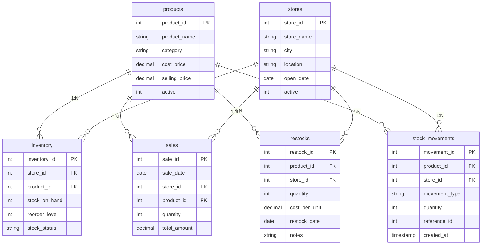

# Smart Inventory & Sales Analysis System
### Enterprise Retail Decision-Support & Supply Chain Analytics Engine

[](https://python.org)
[](https://flask.palletsprojects.com/)
[](https://sqlite.org)
[](https://chartjs.org)
[](https://powerbi.microsoft.com)
[](scripts/run_all_regressions.py)
[](scripts/test_auth.py)

---

## 1. Project Overview

The **Smart Inventory & Sales Analysis System** is an end-to-end, production-grade retail supply chain management and business intelligence platform. Built on historical transaction data from **Maven Toys** (a regional toy retail chain with 50 store locations across Mexico), the system bridges transactional inventory operations (POS sales checkout, inbound restock replenishment, and an immutable double-entry stock movement ledger) with empirical sales velocity analytics, rule-based recommendation signals, and a standardized Power BI Star-Schema data model.

---

## 2. Business Problem

Retail chains managing dozens of distributed stores across multiple merchandise departments frequently suffer from two opposing operational crises:
1. **Stockouts on High-Velocity Products:** Popular, fast-selling SKUs run out of stock without early warning, leading to missed revenue and lost customer goodwill.
2. **Capital Trapped in Overstocked Slow-Movers:** Low-velocity items accumulate excess physical inventory across store branches, tying up working capital and increasing storage costs.
3. **Disconnected Reporting Silos:** Operations teams manage daily inventory in transactional systems without access to analytical velocity metrics, while executive BI dashboards display stale numbers disconnected from transactional stock movements.

This system resolves these challenges by integrating **real-time transactional inventory tracking**, **empirical velocity calculation (units/day)**, **automated inventory reorder thresholds**, and **explainable decision-support recommendations** backed by high-performance SQL indexes and a Power BI Star Schema.

---

## 3. Key Capabilities

- **Atomic Inventory Control:** ACID-compliant sales checkout and inbound restock transactions enforced by SQLite foreign keys and transaction rollbacks.
- **Double-Entry Stock Audit Trail:** Every stock decrement (`SALE`) or increment (`RESTOCK`) writes an immutable record to `stock_movements`.
- **Empirical Sales Velocity Engine:** Dynamic calculation of product velocity (`units sold / calendar trading days`) over custom timeframes or the full 638-day historical baseline.
- **Data-Driven Percentile Classification:** Automatic categorization of catalog items into `FAST MOVING` (Top 25%), `NORMAL` (Middle 50%), and `SLOW MOVING` (Bottom 25%).
- **Rule-Based Decision-Support Engine:** 7 explainable business logic rules evaluating current network stock against reorder thresholds and daily velocity to generate prioritized replenishment actions (`PRIORITIZE REPLENISHMENT`, `REPLENISH SOON`, `MONITOR STOCK`, `REVIEW INVENTORY LEVEL`, `MAINTAIN CURRENT LEVEL`, `MONITOR`).
- **High-Performance Executive Web Dashboard:** 9 interactive Chart.js visualizations driven by SQL-aggregated endpoints, eliminating heavy client-side row loading across 829k sales records.
- **Reports & Normalized Power BI Pipeline:** Standardized automated exporter generating 9 UTF-8 CSV datasets and a portable Star Schema Power BI project (`.pbip`) with 23 pre-built DAX measures.

---

## 4. Technology Stack

- **Backend Framework:** Python 3.10+, Flask 3.0+ (Application Factory pattern, Blueprints, modular service architecture)
- **Database Engine:** SQLite 3 with Write-Ahead Logging (`PRAGMA journal_mode = WAL`), 30-second busy timeout, and composite covering B-tree indexes
- **Frontend / UI:** Semantic HTML5, Vanilla CSS Design System with CSS variables, responsive mobile sidebar drawer, Inter typography, Chart.js 4.4.0 (locally vendored)
- **Data Modeling & Analytics:** Microsoft Power BI (`.pbip` project, TMSL `model.bim`, DAX measures library, Power Query M code)
- **Testing & Verification:** Comprehensive Python regression test suites (147 verification assertions across 8 test suites)

---

## 5. Architecture & End-to-End Data Flow

```
┌────────────────────────────────────────────────────────────────────────┐
│                        DATA INGESTION & STORAGE                        │
├────────────────────────────────────────────────────────────────────────┤
│  Raw CSV Sources          ETL Pipeline                SQLite Database  │
│  (sales, products,   ──►  (scripts/init_db.py)  ──►   (inventory.db)   │
│   stores, inventory)       Cleaning & Indexing        WAL Concurrency  │
└──────────────────────────────────┬─────────────────────────────────────┘
                                   │
                                   ▼
┌────────────────────────────────────────────────────────────────────────┐
│                       FLASK APPLICATION & SERVICES                     │
├────────────────────────────────────────────────────────────────────────┤
│  Operational Layer:          Analytics Layer:        Reporting Layer:  │
│  * POS Sales Checkout        * Sales Velocity        * Table Previews  │
│  * Inbound Restock Flow      * Movement Percentiles  * Export Pipeline │
│  * Atomic Stock Movements    * Rule Recommendation   * ZIP Downloads   │
└──────────────────────────────────┬─────────────────────────────────────┘
                                   │
                                   ▼
┌────────────────────────────────────────────────────────────────────────┐
│                        CONSUMPTION & REPORTING                         │
├────────────────────────────────────────────────────────────────────────┤
│  Web Application (Port 5000)             Power BI Desktop Report       │
│  * Executive Dashboard (9 Charts)        * Star Schema Data Model      │
│  * Inventory Management Grid             * 23 DAX Measures             │
│  * Velocity & Recommendation Tables      * 5 Analytical Pages          │
└────────────────────────────────────────────────────────────────────────┘
```

---

## 6. Dataset Description

The system processes real-world retail store data from Maven Toys:
- **`sales.csv` (21.78 MB, 829,262 rows):** Individual sales checkout events covering **2017-01-01** to **2018-09-30** (638 active trading days). Cumulative volume: **1,090,565 physical units sold**.
- **`products.csv` (1.57 KB, 35 rows):** Catalog merchandise across 5 categories (*Art & Crafts, Electronics, Games, Sports & Outdoors, Toys*) with product cost and retail price.
- **`stores.csv` (2.99 KB, 50 rows):** Physical store locations across 29 Mexican cities, store opening dates (ranging from 1992 to 2014), and location classifications (*Airport, Commercial, Downtown, Residential*).
- **`inventory.csv` (14.67 KB, 1,516 rows raw / 1,750 normalized grid):** Store-SKU current inventory levels.

---

## 7. Database Schema Overview



### High-Performance Composite Indexes
To ensure sub-second query performance over 829,262 sales rows:
- `idx_sales_store_perf` ON `sales(store_id, quantity, total_amount)` (Store-level sales aggregations: 40x speedup from 17.3s &rarr; 0.43s)
- `idx_sales_date_perf` ON `sales(sale_date, quantity, total_amount)` (Daily sales timeline aggregation: 1.5s &rarr; 0.51s)
- `idx_sales_product_perf` ON `sales(product_id, quantity, total_amount)` (Product velocity aggregations: 0.24s)
- `idx_sales_date_prod_agg` ON `sales(sale_date, product_id, quantity, total_amount)` (CTE date-filtered velocity queries: 2.1s)
- `idx_inventory_store_prod` ON `inventory(store_id, product_id)` (Unique composite constraint and instant store-SKU lookups)

---

## 8. Cleaning & ETL Process

The ETL pipeline ([scripts/init_db.py](scripts/init_db.py) and [scripts/data_cleaning.py](scripts/data_cleaning.py)) sanitizes raw CSV files without mutating source data:
1. Strips non-numeric characters, currency symbols (`$`), and commas from prices and IDs.
2. Formats all calendar dates to standard ISO-8601 (`YYYY-MM-DD`).
3. Fills missing store-product combinations with 0 on-hand stock and default reorder levels, normalizing the inventory grid to exactly **1,750 store-SKU pairs** (50 stores &times; 35 products).
4. Generates initial inventory baseline stock movements.

---

## 9. Inventory Logic & Dynamic Stock Status

Each store-SKU dynamically evaluates its stock status based on physical stock on hand and its configured reorder threshold:
- **`OUT OF STOCK`:** `stock_on_hand == 0` (234 store-SKUs / 13.4% of network).
- **`LOW STOCK`:** `0 < stock_on_hand < reorder_level` (526 store-SKUs / 30.1% of network).
- **`NORMAL`:** `stock_on_hand >= reorder_level` (990 store-SKUs / 56.6% of network).

---

## 10. Sales Workflow (Atomic Decrement)

1. User selects Store and Product on `/sales/add`.
2. Asynchronous API (`/api/inventory/lookup`) fetches live stock on hand.
3. Form validates quantity: must be positive integer and cannot exceed `stock_on_hand`.
4. Transaction executes atomically inside a SQLite transaction:
   - Inserts record into `sales`.
   - Decrements `inventory.stock_on_hand` by sale quantity.
   - Logs negative quantity into `stock_movements` with `movement_type = 'SALE'`.
5. If any step fails, the entire transaction rolls back cleanly.

---

## 11. Restock Workflow (Atomic Increment)

1. User selects Store, Product, Quantity, and Cost per Unit on `/restock/add`.
2. Form validates quantity > 0 and cost per unit >= 0.
3. Transaction executes atomically:
   - Inserts record into `restocks`.
   - Increments `inventory.stock_on_hand` by restock quantity.
   - Logs positive quantity into `stock_movements` with `movement_type = 'RESTOCK'`.
4. Updates visible inventory and detail views immediately.

---

## 12. Stock Movement Audit Trail

Every operational transaction modifies the inventory balance exclusively through logged stock movements:
- `INITIAL`: Opening baseline stock initialization.
- `SALE`: Outbound negative unit movement linked to `sale_id`.
- `RESTOCK`: Inbound positive unit movement linked to `restock_id`.

---

## 13. Sales Velocity Methodology

Sales velocity represents the rate at which an item sells per calendar trading day:

$$\text{Sales Velocity} = \frac{\text{Total Units Sold in Period}}{\text{Number of Calendar Trading Days in Period}}$$

For the full historical observation baseline (`2017-01-01` to `2018-09-30`):
- Total Calendar Days: **638 days**
- Total Units Sold: **1,090,565 units**
- Overall Catalog Average Velocity: **48.86 units/day**

---

## 14. Fast / Normal / Slow Classification Methodology

Rather than arbitrary hardcoded cutoffs, movement tiers are derived empirically from the dataset's percentile distribution:
- **Top 25% Velocity Percentile ($\ge 66.43\text{ units/day}$):** Classified as **`FAST MOVING`** (**9 products**).
- **Middle 50% Velocity Percentile ($10.36\text{ to }66.42\text{ units/day}$):** Classified as **`NORMAL`** (**17 products**).
- **Bottom 25% Velocity Percentile ($\le 10.36\text{ units/day}$):** Classified as **`SLOW MOVING`** (**9 products**).

---

## 15. Recommendation Engine Rules

The recommendation engine ([services/recommendation_service.py](services/recommendation_service.py)) evaluates stock coverage cushion:

$$\text{Stock Coverage Days} = \frac{\text{Current Stock on Hand}}{\text{Sales Velocity (units/day)}}$$

7 deterministic rules prioritize replenishment:
1. **Rule B (Priority HIGH):** `FAST MOVING` + `Current Stock == 0` &rarr; **`PRIORITIZE REPLENISHMENT`**
2. **Rule A (Priority HIGH):** `FAST MOVING` + `Current Stock < Reorder Level` &rarr; **`REPLENISH SOON`**
3. **Rule C (Priority MEDIUM):** `FAST MOVING` + `Stock Coverage < 14 Days` &rarr; **`MONITOR STOCK`**
4. **Rule D (Priority MEDIUM):** `SLOW MOVING` + `Current Stock >= Reorder Level` &rarr; **`REVIEW INVENTORY LEVEL`**
5. **Rule E (Priority MEDIUM):** `SLOW MOVING` + `Current Stock < Reorder Level` &rarr; **`REPLENISH OR REVIEW`**
6. **Rule F (Priority LOW):** `NORMAL` + `Current Stock >= Reorder Level` &rarr; **`MAINTAIN CURRENT LEVEL`**
7. **Rule G (Priority NONE):** Fallback healthy / balanced inventory &rarr; **`MONITOR`**

Chain-wide aggregate baseline: **7 products require operational attention** (7 Medium priority, 0 High priority at aggregate chain level).

---

## 16. Dashboard & Analytics

The executive dashboard (`/dashboard`) provides 9 responsive visualizations:
1. **Sales Volume Trend:** Daily units sold timeline with moving average.
2. **Calculated Revenue Trend:** Financial volume timeline.
3. **Category Sales Breakdown:** Donut chart of volume by merchandise department.
4. **Top 10 Selling Products:** Horizontal bar chart of catalog volume leaders.
5. **Network Inventory Health:** Donut chart of Normal, Low Stock, and Out of Stock store-SKUs.
6. **On-Hand Units by Category:** Physical stock volume distribution.
7. **Store Sales Performance:** Top 5, Top 10, or All 50 retail branches.
8. **Movement Tier Distribution:** Fast, Normal, and Slow distribution.
9. **Decision Support Alerts:** Inventory Attention summary cards.

---

## 17. Power BI Integration

The system includes a dedicated Power BI Project under [powerbi/](powerbi):
- **Project Structure:** `SmartInventory_Analytics.pbip` with dataset definition and TMSL `model.bim`.
- **Configurable `SourceFolder` Parameter:** Relative path default (`..\exports\powerbi\`) enables portable opening from any machine directory.
- **Strict Star Schema:** Dimensions filter facts exclusively in a single direction (`oneDirection`). Zero bidirectional relationships.
- **23 Pre-Built DAX Measures:** Formatted in [exports/powerbi/dax_measures.dax](exports/powerbi/dax_measures.dax).

---

## 18. Calculated Revenue Definition

> [!IMPORTANT]
> Historical sales checkout logs from Maven Toys recorded unit quantities sold without itemized register receipt checkout prices. Revenue figures across the entire project represent **Calculated Revenue** evaluated at catalog retail selling price:
>
> $$\text{Calculated Revenue} = \sum (\text{Quantity Sold} \times \text{Catalog Retail Selling Price})$$
>
> These are decision-support estimates and should not be presented as statutory financial accounting receipts.

---

## 19. Calculated Inventory Valuation Definition

> [!IMPORTANT]
> Inventory valuation represents **Calculated Valuation** evaluated at retail catalog selling price:
>
> $$\text{Calculated Inventory Value} = \sum (\text{Stock on Hand} \times \text{Catalog Retail Selling Price})$$

---

## 20. Current Inventory Snapshot Limitation

> [!IMPORTANT]
> Inventory balances (`stock_on_hand`, `stock_status`, `inventory_value`) represent the **live operational snapshot** of the retail chain. They do **not** represent historical daily store balances across 2017–2018. When filtering sales by date, inventory stock figures reflect the current state.

---

## 21. How to Install Dependencies

1. Clone repository:
   ```bash
   git clone https://github.com/your-username/inventory-analysis.git
   cd inventory-analysis
   ```
2. Create and activate a Python virtual environment:
   ```bash
   python -m venv venv
   # On Windows:
   .\venv\Scripts\activate
   # On Linux/macOS:
   source venv/bin/activate
   ```
3. Install required packages:
   ```bash
   pip install -r requirements.txt
   ```

---

## 22. How to Initialize / Import the Database

The repository ships with the validated baseline database at `database/inventory.db`. To re-import from raw source CSVs:
```bash
python scripts/init_db.py
```
This sanitizes the raw data, creates all tables, builds composite covering indexes, and populates the database to the verified baseline.

---

## 23. How to Start Flask

```bash
python app.py
```
Open your browser and navigate to:
```text
http://127.0.0.1:5000
```

---

## 24. Enterprise Authentication & Role-Based Access Control (RBAC)

The application features a production-hardened authentication architecture designed for enterprise security and multi-role operations:

### Security Highlights
- **Password Security:** Passwords hashed with PBKDF2-SHA256 (Werkzeug) with minimum 8 characters, character variety rules, and a common weak password blacklist. Plaintext passwords are never stored or logged.
- **Least-Privilege Public Registration:** Public self-registration (`/signup`) unconditionally assigns the least-privileged **Store Associate** role. Administrative escalation is strictly barred.
- **Role Hierarchy & Governance:** Four operational roles enforced server-side via `@login_required` and `@role_required(...)`:
  - `Administrator`: Full access, user governance (`/admin/users`), role management, account activation.
  - `Inventory Manager`: Master catalog, inbound restocking, physical inventory, POS transactions, analytics, reports.
  - `Data Analyst`: Executive dashboard, velocity analytics, recommendation engine, reporting previews, and Power BI datasets.
  - `Store Associate`: Day-to-day POS checkout operations and physical stock lookup.
- **CSRF Protection:** State-changing POST requests across all modules are protected by `Flask-WTF` (`CSRFProtect`).
- **Brute-Force & Abuse Defense:** Accounts are temporarily locked for 15 minutes following 5 consecutive failed sign-in attempts (`locked_until`). Timing attacks are mitigated via dummy hash checks.
- **Session Security:** `SESSION_COOKIE_HTTPONLY = True`, `SESSION_COOKIE_SAMESITE = 'Lax'`, configurable `Secure` cookie flag for HTTPS, explicit 7-day session lifetime, and session fixation defense via `session.clear()`.
- **Branded Error Handling:** Custom branded pages for `401 Unauthorized`, `403 Forbidden`, `404 Not Found`, and `500 Server Error`.

### Development & Demo Credentials
For local development and testing, demo credentials can be configured via environment variables with safe defaults:
- **System Administrator:** `admin@inventory.com` (Default dev pass: `AdminDev@2026`)
- **Inventory Manager:** `manager@inventory.com` (Default dev pass: `ManagerDev@2026`)
- **Data Analyst:** `analyst@inventory.com` (Default dev pass: `AnalystDev@2026`)
- **Store Associate:** `associate@inventory.com` (Default dev pass: `AssociateDev@2026`)

*Note: In production deployments, demo accounts must be seeded via secure environment variables or created via administrative governance.*

---

## 25. How to Run All Tests

To run the complete automated test suite across all 12 development and security phases in one command:
```bash
python scripts/run_all_regressions.py
```

Or execute individual test suites:
```bash
# Core Domain Regressions (Phases 6–12)
python scripts/test_phase6.py
python scripts/test_phase7.py
python scripts/test_phase8.py
python scripts/test_phase9.py
python scripts/test_phase10.py
python scripts/test_phase11.py
python scripts/test_phase12.py

# Power BI Data Model & Measures (Phase 13)
python scripts/validate_phase13_model.py
python scripts/test_phase13.py

# Route Presentation & Business Workflow (Phase 14)
python scripts/test_route_validation.py
python scripts/test_business_workflow.py

# Enterprise Authentication & RBAC Suite
python scripts/test_auth.py
```

---

## 26. Expected Baseline Validation Numbers

All analytical calculations, test suites, and Power BI models must reconcile to these exact baseline numbers:

| Metric | Baseline Value | Source Table / Definition |
|:---|:---:|:---|
| **Products Count** | `35` | Master catalog products |
| **Stores Count** | `50` | Active retail branch stores |
| **Store-SKU Inventory Combinations** | `1,750` | 50 stores &times; 35 products |
| **Historical Sales Records** | `829,262` | Checkout transaction rows |
| **Inbound Restocks** | `0` | Clean baseline state |
| **Logged Stock Movements** | `1,516` | Initial opening movements |
| **Total Units Sold** | `1,090,565` | Sum of historical quantities |
| **Total Calculated Revenue** | `$14,444,572.35` | Units &times; selling price |
| **Current Inventory Stock Units** | `29,742` | Physical on-hand stock |
| **Calculated Inventory Valuation** | `$410,240.58` | Stock &times; selling price |
| **Low Stock Store-SKUs** | `526` | 0 < stock < reorder level |
| **Out of Stock Store-SKUs** | `234` | stock == 0 |
| **Normal Stock Store-SKUs** | `990` | stock >= reorder level |
| **Movement Classification (Fast/Normal/Slow)** | `9 / 17 / 9` | Empirical velocity percentiles |
| **Products Requiring Attention** | `7` | High + Medium recommendation priority |

---

## 27. Folder Structure

```text
inventory-analysis/
├── app.py                      # Main Flask application factory & routing
├── config.py                   # Environment configuration & app settings
├── db.py                       # SQLite database connection & teardown hooks
├── requirements.txt            # Python dependencies (Flask, Werkzeug, Flask-WTF)
├── README.md                   # Comprehensive project documentation
├── .gitignore                  # Git commit exclusions
├── database/
│   └── inventory.db            # Production SQLite database (WAL mode)
├── data/
│   └── raw/                    # Immutable raw source CSV files
│       ├── products.csv
│       ├── stores.csv
│       ├── inventory.csv
│       └── sales.csv
├── docs/                       # Technical architecture & verification docs
│   ├── authentication_verification_report.md
│   ├── powerbi_report.md
│   └── final_verification_report.md
├── exports/
│   └── powerbi/                # Normalized Power BI export pipeline
│       ├── sales_daily.csv
│       ├── sales_category.csv
│       ├── product_movement.csv
│       ├── inventory_snapshot.csv
│       ├── store_sales.csv
│       ├── recommendations.csv
│       ├── dim_date.csv
│       ├── dim_products.csv
│       ├── dim_stores.csv
│       ├── dax_measures.dax
│       ├── powerquery_m_code.m
│       └── README.md
├── powerbi/                    # Microsoft Power BI Project (.pbip)
│   ├── SmartInventory_Analytics.pbip
│   ├── SmartInventory_Analytics.Dataset/
│   │   ├── definition.pbidataset
│   │   └── model.bim
│   └── SmartInventory_Analytics.Report/
│       ├── definition.pbir
│       └── report.json
├── services/                   # Modular business logic services
│   ├── auth_service.py         # Authentication, PBKDF2 hashing, RBAC, abuse defense
│   ├── analytics_service.py    # Sales velocity & percentile movement classification
│   ├── recommendation_service.py # Rule-based inventory recommendation engine
│   ├── dashboard_service.py    # SQL aggregations for interactive Chart.js widgets
│   └── report_service.py       # Reporting previews & CSV export pipeline
├── static/
│   ├── css/
│   │   └── style.css           # Core design system styles
│   ├── js/
│   │   ├── main.js             # Navigation & global UI scripts
│   │   └── dashboard.js        # Chart.js asynchronous chart managers
│   └── vendor/
│       └── chart.umd.min.js    # Vendored Chart.js 4.4.0 library
├── templates/                  # Jinja2 presentation templates
│   ├── base.html
│   ├── login.html              # Hardened Sign-In with remember me & eye toggle
│   ├── signup.html             # Safe Sign-Up with strength meter & checklist
│   ├── dashboard.html
│   ├── products.html
│   ├── add_product.html
│   ├── edit_product.html
│   ├── product_detail.html
│   ├── inventory.html
│   ├── sales.html
│   ├── add_sale.html
│   ├── sale_detail.html
│   ├── restock.html
│   ├── add_restock.html
│   ├── restock_detail.html
│   ├── analytics.html
│   ├── recommendations.html
│   ├── reports.html
│   ├── admin/
│   │   └── users.html          # Administrator User & Role Governance
│   └── errors/
│       ├── 401.html            # Branded Unauthorized Error Page
│       ├── 403.html            # Branded Forbidden Error Page
│       ├── 404.html            # Branded Page Not Found
│       └── 500.html            # Branded Server Error
└── scripts/                    # Test suites & CLI automation utilities
    ├── init_db.py
    ├── data_cleaning.py
    ├── export_reports.py
    ├── build_powerbi_project.py
    ├── test_phase6.py
    ├── test_phase7.py
    ├── test_phase8.py
    ├── test_phase9.py
    ├── test_phase10.py
    ├── test_phase11.py
    ├── test_phase12.py
    ├── validate_phase13_model.py
    ├── test_phase13.py
    ├── test_route_validation.py
    ├── test_business_workflow.py
    ├── test_auth.py            # 25 Enterprise security & RBAC tests
    ├── test_auth_browser_headless.py # Headless Chrome browser renderer
    └── run_all_regressions.py  # Master test runner (12/12 suites)
```

---

## 28. Known Limitations

1. **Headless BI Validation Scope:** Visual rendering inside the Power BI Desktop GUI was not performed because this verification environment runs headlessly via CLI. The project supplies complete data model definitions, Star Schema single-direction relationships, M transformations, 23 DAX measures, and `.pbip` schema files ready for immediate opening in Power BI Desktop.
2. **Current vs. Historical Inventory:** Store inventory stock balances represent the live current operational snapshot. Historical daily stock balances are not reconstructed from sales dates.
3. **Calculated Revenue:** Revenue is estimated using units &times; catalog retail price rather than cashier register receipt pricing.
4. **Session Scope:** Sessions rely on signed HTTPOnly cookies (`SECRET_KEY`). Distributed multi-node scaling would use Redis. MFA/TOTP and email password resets are deferred production opportunities.

---

## 29. Project Status

**AUTHENTICATION UPGRADE & PHASES 1–14 FULLY COMPLETE, HARDENED, AND VERIFIED.**  
All 12 automated test suites (172+ assertions) pass with 100% green status. All data models, web interfaces, authentication controls, and documentation are synchronized with zero regressions.
