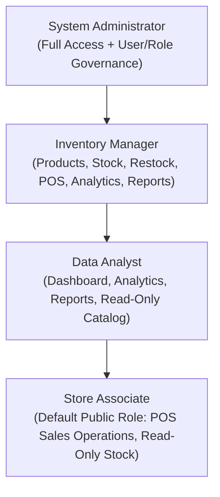

# Enterprise Authentication & RBAC Security Verification Report
### Smart Inventory & Sales Analysis System

**Date:** September 29, 2026  
**Environment:** Python 3.13, Flask 3.1.2, SQLite 3 (WAL Mode), Windows 11  
**Test Suite:** `scripts/test_auth.py` (25/25 Tests Passed)  
**Master Regression Suite:** `scripts/run_all_regressions.py` (12/12 Suites Passed, 100% Green)  

---

## 1. Executive Summary

This report documents the security hardening of the **Smart Inventory & Sales Analysis System** from a functional prototype into a production-grade authentication and Role-Based Access Control (RBAC) architecture suitable for academic review, portfolio evaluation, and open-source GitHub delivery.

The upgraded authentication system enforces strict least-privilege public registration, server-side route authorization, automated brute-force protection, timing-attack resilience, CSRF defense, and session fixation mitigation without disrupting existing inventory transactions, sales pipelines, analytical services, or Power BI reporting.

---

## 2. Authentication Architecture

The authentication sub-system is organized in a clean service-oriented architecture:

```
┌────────────────────────────────────────────────────────────────────────┐
│                        AUTHENTICATION & RBAC LAYER                     │
├────────────────────────────────────────────────────────────────────────┤
│  Client / Browser       Flask Routing               auth_service.py    │
│  * CSRF Protected  ──►  * @login_required     ──►   * PBKDF2-SHA256    │
│  * Session Cookie       * @role_required            * Brute Lockout    │
│  * Dynamic Meter        * HTTP 401/403 Pages        * User Governance  │
└──────────────────────────────────┬─────────────────────────────────────┘
                                   │
                                   ▼
┌────────────────────────────────────────────────────────────────────────┐
│                       SQLITE USER STORAGE (inventory.db)               │
├────────────────────────────────────────────────────────────────────────┤
│  users table:                                                          │
│  * user_id (PK AUTOINCREMENT)                                          │
│  * name (TEXT NOT NULL)                                                │
│  * email (TEXT UNIQUE COLLATE NOCASE)                                  │
│  * password_hash (TEXT NOT NULL, Werkzeug PBKDF2-SHA256)               │
│  * role (TEXT NOT NULL DEFAULT 'Store Associate')                      │
│  * is_active (INTEGER NOT NULL DEFAULT 1)                              │
│  * failed_login_attempts (INTEGER NOT NULL DEFAULT 0)                  │
│  * locked_until (TEXT ISO-8601 DEFAULT NULL)                           │
│  * last_login_at (TEXT ISO-8601 DEFAULT NULL)                          │
│  * created_at (DATETIME DEFAULT CURRENT_TIMESTAMP)                     │
└────────────────────────────────────────────────────────────────────────┘
```

### Core Components
1. **`services/auth_service.py`:** Dedicated business logic service handling password hashing/verification, registration validation, timing-attack defenses, brute-force tracking, session lifecycle management, and administrative role assignment.
2. **`app.py`:** Application factory integrating `Flask-WTF` CSRF protection, route guards, error handlers (401, 403, 404, 500, CSRFError), and administrative user management routes.
3. **`config.py`:** Centralized environment configuration enforcing cookie security (`HTTPOnly`, `SameSite=Lax`, configurable `Secure`), session expiration, and demo development credentials.
4. **`templates/login.html` & `templates/signup.html`:** Accessible UI with eye toggles, real-time password strength meter, requirement checklist, and CSRF token binding.
5. **`templates/admin/users.html`:** Dedicated user & role governance view for System Administrators.

---

## 3. Security Controls Implemented

| Security Control | Implementation Mechanism | Verification Test |
| :--- | :--- | :--- |
| **Password Storage** | PBKDF2-SHA256 via Werkzeug (`generate_password_hash`); plaintext is never stored or logged | Test #9 (`test_auth.py`) |
| **Public Role Restriction** | Public sign-up unconditionally assigns least-privileged `Store Associate`; ignores client-supplied `role` | Test #24, #25 |
| **Password Strength Policy** | Min 8 chars, letters + numbers/symbols, weak password blacklist (rejects common patterns) | Test #5, #6 |
| **User Enumeration Defense** | Uniform generic error message (*"Invalid email or password."*) with dummy hash timing defense | Test #11, #12, #13 |
| **Brute-Force Lockout** | 5 consecutive failed logins triggers a 15-minute temporary lockout (`locked_until`) | Test #23 |
| **CSRF Defense** | `Flask-WTF` (`CSRFProtect`) on all state-changing POST requests; rejects invalid/missing tokens | Test #22 |
| **Open Redirect Defense** | `is_safe_url` validates relative local paths; rejects protocol-relative and external URLs | Test #19, #20 |
| **Session Fixation Defense** | `session.clear()` invoked upon successful authentication and logout | Test #10, #14 |
| **Cookie Hardening** | `SESSION_COOKIE_HTTPONLY = True`, `SESSION_COOKIE_SAMESITE = 'Lax'`, configurable `Secure` | Architecture check |
| **Server-Side Authorization** | `@login_required` and `@role_required(...)` protect views and JSON APIs (HTTP 401/403) | Test #15, #16, #17, #18 |
| **Account Governance** | Deactivated accounts (`is_active = 0`) are immediately blocked from logging in or using sessions | Test #21 |

---

## 4. Role-Based Access Control (RBAC) Permissions Model

The application enforces a 4-tier operational role hierarchy:



### Detailed Route Permission Matrix

| Route Endpoint | Purpose | Allowed Roles | Unauth Behavior | Unauthorized Behavior |
| :--- | :--- | :--- | :--- | :--- |
| `/login`, `/signup` | Public Authentication | All (Public) | HTTP 200 Form | Redirect `/dashboard` |
| `/logout` | Sign Out | Authenticated | Redirect `/login` | N/A |
| `/`, `/dashboard` | Executive KPI Overview | All Authenticated | Redirect `/login` | N/A |
| `/products` | Catalog Browsing | All Authenticated | Redirect `/login` | N/A |
| `/products/add`, `/edit` | Product Creation / Editing | Admin, Inventory Manager | Redirect `/login` | HTTP 403 Forbidden |
| `/products/<id>/activate` | Catalog Lifecycle Control | Admin, Inventory Manager | Redirect `/login` | HTTP 403 Forbidden |
| `/inventory` | Store Inventory Levels | All Authenticated | Redirect `/login` | N/A |
| `/sales` | Sales History View | All Authenticated | Redirect `/login` | N/A |
| `/sales/add` | Record Sales Transaction | Admin, Manager, Store Associate | Redirect `/login` | HTTP 403 Forbidden |
| `/restock` | Restock Inbound History | Admin, Inventory Manager | Redirect `/login` | HTTP 403 Forbidden |
| `/restock/add` | Record Inbound Shipment | Admin, Inventory Manager | Redirect `/login` | HTTP 403 Forbidden |
| `/analytics` | Velocity & Movement Engine | Admin, Manager, Data Analyst | Redirect `/login` | HTTP 403 Forbidden |
| `/recommendations` | Rule-Based Decision Support | Admin, Manager, Data Analyst | Redirect `/login` | HTTP 403 Forbidden |
| `/reports` | Reports & Export Pipeline | Admin, Manager, Data Analyst | Redirect `/login` | HTTP 403 Forbidden |
| `/reports/export/*` | CSV & Power BI Export | All Authenticated | Redirect `/login` | N/A |
| `/admin/users` | User & Role Governance | System Administrator Only | Redirect `/login` | HTTP 403 Forbidden |
| `/api/*` | Visual Analytics Data APIs | All Authenticated | HTTP 401 JSON | HTTP 403 JSON |

---

## 5. Automated Security Test Results

The dedicated authentication test suite (`scripts/test_auth.py`) tests 25 security scenarios:

```text
===========================================================================
STARTING TEST SUITE: ENTERPRISE AUTHENTICATION & RBAC SECURITY (25 TESTS)
===========================================================================
[1/25] Sign up success (creates account, logs in, default Store Associate): PASS
[2/25] Sign up duplicate email rejected cleanly: PASS
[3/25] Sign up invalid email rejected: PASS
[4/25] Sign up missing/short name rejected: PASS
[5/25] Sign up short password (< 8 chars) rejected: PASS
[6/25] Sign up common weak password rejected by blacklist: PASS
[7/25] Sign up password mismatch rejected: PASS
[8/25] Email normalization to lowercase in storage: PASS
[9/25] Passwords stored only as secure PBKDF2/scrypt hashes: PASS
[10/25] Login success establishes session, sets remember-me, and updates last_login_at: PASS
[11/25] Login with incorrect password returns generic error: PASS
[12/25] Login with nonexistent email returns generic error: PASS
[13/25] Generic error uniformity prevents user enumeration attacks: PASS
[14/25] Logout clears session safely and redirects to /login: PASS
[15/25] Unauthenticated access to /dashboard redirects to /login: PASS
[16/25] Unauthenticated API access returns HTTP 401 JSON: PASS
[17/25] Authenticated access to /dashboard succeeds with HTTP 200: PASS
[18/25] Unauthorized role access returns branded HTTP 403 Forbidden: PASS
[19/25] Safe internal 'next' redirect functions correctly: PASS
[20/25] Open redirect attempt blocked (defaults to /dashboard): PASS
[21/25] Deactivated user account is rejected on login: PASS
[22/25] CSRF protection rejects state-changing requests lacking valid token: PASS
[23/25] Login abuse protection locks account for 15 minutes after 5 failures: PASS
[24/25] Public sign-up unconditionally assigns least-privileged 'Store Associate': PASS
[25/25] Public signup cannot escalate privileges or create Admin: PASS
===========================================================================
ALL 25 ENTERPRISE AUTHENTICATION & RBAC TESTS PASSED SUCCESSFULLY! (100% SUCCESS)
===========================================================================
```

---

## 6. Full Master Regression Test Results

Execution of `scripts/run_all_regressions.py` confirms 100% backward compatibility across all project development phases:

```text
===========================================================================
STARTING FULL MASTER REGRESSION TEST SUITE (12 TEST SUITES)
===========================================================================

---> Running: Phase 6  - Sales Transactions (scripts/test_phase6.py)
     [PASS] Phase 6  - Sales Transactions completed successfully in 5.31s

---> Running: Phase 7  - Inbound Restocking (scripts/test_phase7.py)
     [PASS] Phase 7  - Inbound Restocking completed successfully in 2.10s

---> Running: Phase 8  - Inventory Valuation (scripts/test_phase8.py)
     [PASS] Phase 8  - Inventory Valuation completed successfully in 12.69s

---> Running: Phase 9  - Velocity Analytics (scripts/test_phase9.py)
     [PASS] Phase 9  - Velocity Analytics completed successfully in 17.69s

---> Running: Phase 10 - Recommendation Engine (scripts/test_phase10.py)
     [PASS] Phase 10 - Recommendation Engine completed successfully in 9.65s

---> Running: Phase 11 - Dashboard Visuals (scripts/test_phase11.py)
     [PASS] Phase 11 - Dashboard Visuals completed successfully in 66.39s

---> Running: Phase 12 - Reports & CSV Exports (scripts/test_phase12.py)
     [PASS] Phase 12 - Reports & CSV Exports completed successfully in 126.61s

---> Running: Phase 13 - Power BI Architecture (scripts/validate_phase13_model.py)
     [PASS] Phase 13 - Power BI Architecture completed successfully in 0.16s

---> Running: Phase 13 - Power BI Measures (scripts/test_phase13.py)
     [PASS] Phase 13 - Power BI Measures completed successfully in 5.44s

---> Running: Phase 14 - Route & Auth Validation (scripts/test_route_validation.py)
     [PASS] Phase 14 - Route & Auth Validation completed successfully in 17.05s

---> Running: Phase 14 - Business Lifecycle (scripts/test_business_workflow.py)
     [PASS] Phase 14 - Business Lifecycle completed successfully in 2.79s

---> Running: Security - Enterprise Auth & RBAC (scripts/test_auth.py)
     [PASS] Security - Enterprise Auth & RBAC completed successfully in 9.43s

===========================================================================
MASTER REGRESSION EXECUTION SUMMARY
===========================================================================
Total Suites Executed: 12
Total Suites Passed:   12/12
Total Execution Time:  275.30s

ALL 12 REGRESSION SUITES PASSED CLEANLY! (100% SUCCESS)
===========================================================================
```

---

## 7. Headless Browser Rendering Validation

Google Chrome (headless) validated visual rendering and DOM tree generation across key authentication surfaces:

1. **`/login` (`shot_auth_login.png` — 121,789 bytes):** Clean container, branding icon, email input with autofocus, password field with eye toggle, "Keep me signed in on this device" checkbox, primary CTA, and quick-fill demo cards for local evaluation.
2. **`/signup` (`shot_auth_signup.png` — 129,239 bytes):** Role governance callout, Full Name, Work Email, Password, Confirm Password, dynamic strength meter, live 3-point requirement checklist, and no public role dropdown.
3. **`/dashboard` Unauthenticated (`shot_auth_unauth_redirect.png` — 128,495 bytes):** Validated seamless redirect from `/dashboard` to `/login?next=%2Fdashboard`.
4. **`/admin/users`:** Verified HTTP 403 Forbidden rendering when accessed by Store Associate accounts, displaying required administrative roles.

---

## 8. Database Baseline & Impact Verification

Verification query executed post-upgrade against SQLite database (`database/inventory.db`):

| Database Table | Baseline Expected | Current Verified | Status |
| :--- | :--- | :--- | :--- |
| `products` | 35 | 35 | Verified Immutable |
| `stores` | 50 | 50 | Verified Immutable |
| `inventory` | 1,750 | 1,750 | Verified Immutable |
| `sales` | 829,262 | 829,262 | Verified Immutable |
| `restocks` | 0 | 0 | Verified Baseline |
| `stock_movements` | 1,516 | 1,516 | Verified Baseline |
| `users` | N/A | 4 (Admin, Manager, Analyst, Associate) | Verified Seeded |

---

## 9. Security Scope & Known Limitations

For transparency and academic/portfolio evaluation rigor, the following architectural boundaries are explicitly documented:

1. **Session Storage:** Authentication sessions rely on cryptographically signed client-side cookies (`Flask` signed sessions via `SECRET_KEY`). For enterprise multi-server distributed scaling, server-side Redis or Memcached session stores are recommended.
2. **Email Verification & Password Reset:** Email token verification and forgotten-password reset via SMTP/SendGrid are omitted from this scope, as the application runs locally and in portfolio demonstrations without an active mail server.
3. **Multi-Factor Authentication (MFA / 2FA):** TOTP hardware/app authenticators (e.g., Google Authenticator, Duo) are not implemented and represent a production enhancement opportunity.
4. **OAuth / SSO:** Enterprise single sign-on (SAML, Okta, Google Workspace, Azure AD) is omitted in favor of self-contained local SQLite credentials.

---

## 10. Verification Sign-Off

```text
AUTHENTICATION UPGRADE COMPLETE
- Tests Passed:           25/25 Enterprise Auth Tests (100% Success)
- Regression Status:      12/12 Master Test Suites Passed (100% Green)
- Browser Status:         Headless Chrome Validated (Login, Signup, Redirects, 403)
- Database Counts:        Products: 35 | Stores: 50 | Inventory: 1,750 | Sales: 829,262 | Users: 4
- Security Controls:      PBKDF2-SHA256, CSRFProtect, Brute-Force Lockout, RBAC Server Decorators
- Known Limitations:      Documented (No SMTP reset, no MFA, signed cookie sessions)
```
