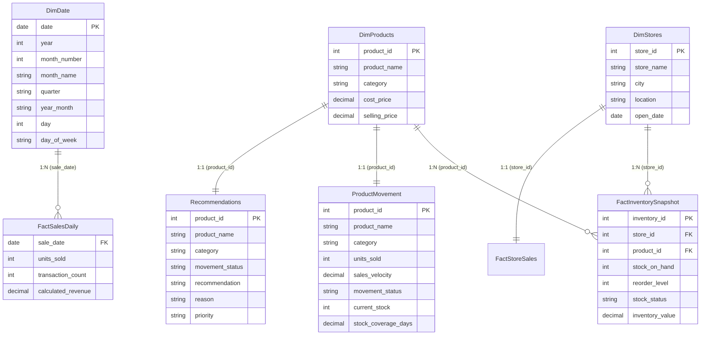

# Power BI Report Modeling & Analytics Documentation
## Smart Inventory & Sales Analysis System (Phase 13)

---

## 1. Executive Summary & Objective

This document provides complete technical and architectural specifications for the **Smart Inventory & Sales Analysis System** Power BI reporting suite. 

The report connects directly to the normalized, standardized CSV exports generated from the operational SQLite database (`inventory.db`) under `exports/powerbi/`. The data model is architected as an **unambiguous Star Schema**, separating high-performance dimensional tables from transactional and snapshot fact tables.

All metrics, DAX expressions, and visual calculations reconcile 100% with the application database baseline established across Phases 1 through 12.

> [!IMPORTANT]
> **Fundamental Operational Semantics & Non-Financial Distinctions:**
> 1. **Historical Sales Baseline (`2017-01-01` to `2018-09-30`):**
>    Sales metrics (`units_sold`, `calculated_revenue`, `sales_velocity`, `transaction_count`) represent historical transactional performance across a fixed **638-day calendar trading observation period**.
> 2. **Current Application Inventory State:**
>    Inventory stock balances (`stock_on_hand`, `reorder_level`, `stock_status`, `inventory_value`) represent the **live operational snapshot** of the retail chain (50 store branches &times; 35 catalog products). They are **not** historical daily inventory balances.
> 3. **Calculated Revenue & Valuation:**
>    Because historical checkout records stored unit quantities without itemized cashier register prices, all revenue figures represent **Calculated Revenue** evaluated at catalog retail selling price (`SUM(quantity * selling_price)`). Similarly, inventory valuation is calculated as `stock_on_hand * selling_price`. They are decision-support estimates and should not be presented as statutory financial accounting receipts.
> 4. **Sales Velocity & Empirical Classification:**
>    Empirical daily velocity is calculated as `Units Sold / 638 Active Trading Days`. Movement classifications (`FAST MOVING`, `NORMAL`, `SLOW MOVING`) are derived from empirical percentile distributions (Top 25%, Middle 50%, Bottom 25%) computed by the analytics service.
> 5. **Decision-Support Recommendations:**
>    Recommendations (`PRIORITIZE REPLENISHMENT`, `REPLENISH SOON`, `MONITOR STOCK`, `REVIEW INVENTORY LEVEL`, `MAINTAIN CURRENT LEVEL`, `MONITOR`) are rule-based operational guidance signals based on stock coverage days and velocity tiers.

---

## 2. Imported Data Sources & Table Grains

The Power BI data model imports 9 clean, normalized UTF-8 CSV datasets from `exports/powerbi/`:

| Table Name in Power BI | Source File | Row Count | Table Grain | Primary Key | Description |
|:---|:---|:---:|:---|:---|:---|
| **`DimDate`** | `dim_date.csv` | 638 | 1 row per calendar day | `date` | Contiguous historical calendar dimension (`2017-01-01` to `2018-09-30`). |
| **`DimProducts`** | `dim_products.csv` | 35 | 1 row per catalog product | `product_id` | Master catalog dimension with categories, costs, and selling prices. |
| **`DimStores`** | `dim_stores.csv` | 50 | 1 row per retail store | `store_id` | Master retail store dimension with cities, locations, and open dates. |
| **`FactSalesDaily`** | `sales_daily.csv` | 638 | 1 row per calendar day | `sale_date` | Aggregated daily sales volume, transaction count, and calculated revenue. |
| **`FactInventorySnapshot`** | `inventory_snapshot.csv` | 1,750 | 1 row per store-SKU | `inventory_id` | Current physical stock, reorder levels, stock status, and valuation. |
| **`FactStoreSales`** | `store_sales.csv` | 50 | 1 row per retail store | `store_id` | Cumulative store-level historical volume, transactions, and revenue. |
| **`ProductMovement`** | `product_movement.csv` | 35 | 1 row per catalog product | `product_id` | Velocity metrics, percentile movement tiers, and aggregate coverage days. |
| **`Recommendations`** | `recommendations.csv` | 35 | 1 row per catalog product | `product_id` | Replenishment guidance signals, explainable reasons, and priority ranks. |
| **`SalesCategory`** | `sales_category.csv` | 5 | 1 row per merchandise category | `category` | Departmental sales volume, transactions, revenue, and average basket sizes. |

---

## 3. Data Model Architecture (Star Schema)

The data model uses an intuitive, ambiguity-free Star Schema. Dimensional tables filter fact tables in a 1-to-Many (`1:*`) direction. Analytical snapshot tables are linked to their respective dimensions via 1-to-1 (`1:1`) bidirectional relationships to enable seamless cross-filtering across visuals.



### Documented Relationships Table

| From Table (Fact / Snapshot) | Foreign Key Column | To Table (Dimension) | Primary Key Column | Cardinality | Cross-Filter Direction | Relationship Type |
|:---|:---|:---|:---|:---:|:---:|:---|
| `FactSalesDaily` | `sale_date` | `DimDate` | `date` | Many-to-One (`*:1`) | Single (`DimDate` &rarr; `FactSalesDaily`) | Active Date Dimension Filter |
| `FactInventorySnapshot` | `product_id` | `DimProducts` | `product_id` | Many-to-One (`*:1`) | Single (`DimProducts` &rarr; `FactInventorySnapshot`) | Active Product Dimension Filter |
| `FactInventorySnapshot` | `store_id` | `DimStores` | `store_id` | Many-to-One (`*:1`) | Single (`DimStores` &rarr; `FactInventorySnapshot`) | Active Store Dimension Filter |
| `ProductMovement` | `product_id` | `DimProducts` | `product_id` | One-to-One (`1:1`) | Single (`DimProducts` &rarr; `ProductMovement`) | Analytical Product Extension Filter |
| `Recommendations` | `product_id` | `DimProducts` | `product_id` | One-to-One (`1:1`) | Single (`DimProducts` &rarr; `Recommendations`) | Decision-Support Extension Filter |
| `FactStoreSales` | `store_id` | `DimStores` | `store_id` | One-to-One (`1:1`) | Single (`DimStores` &rarr; `FactStoreSales`) | Store Performance Extension Filter |

> [!NOTE]
> **Strict Star-Schema Single-Direction Filtering:**
> Every relationship in the data model uses **Single Direction** (`oneDirection`) filtering. The dimensions (`DimProducts`, `DimStores`, `DimDate`) filter the fact and snapshot tables, but analytical/fact tables do not filter back into the dimensions. This eliminates ambiguous filter paths, protects measure context transitions, and ensures deterministic performance.
>
> **Portable Path Parameter (`SourceFolder`):**
> All Power Query M table partitions reference a central parameter named `SourceFolder` rather than hardcoded machine file paths. By default, `SourceFolder` uses the relative directory `..\exports\powerbi\`. When moving the project across different environments or machines, the path can be reconfigured once via Power BI Desktop's **Home &rarr; Transform Data &rarr; Manage Parameters**, instantly repopulating all 9 tables without editing individual queries.

---

## 4. Date Dimension Specification

The date dimension table (`DimDate`) covers the historical sales period from `2017-01-01` to `2018-09-30` (638 contiguous days).

### Table Attributes:
1. `date` (`DateTime / Date`): Primary calendar key (`YYYY-MM-DD`).
2. `year` (`Int64`): Calendar year (`2017`, `2018`).
3. `month_number` (`Int64`): Calendar month index (`1` to `12`).
4. `month_name` (`Text`): English month name (`January` to `December`), sorted by `month_number`.
5. `quarter` (`Text`): Fiscal quarter (`Q1`, `Q2`, `Q3`, `Q4`).
6. `year_month` (`Text`): Year-Month sortable string (`2017-01` to `2018-09`).
7. `day` (`Int64`): Day of month (`1` to `31`).
8. `day_of_week` (`Text`): Day of week string (`Monday` to `Sunday`).

### Power BI Configuration:
- In Power BI Desktop, right-click `DimDate` &rarr; **Mark as Date Table** &rarr; Select `date` column.
- Verify `month_name` is sorted by `month_number`.

### Alternative DAX Generation:
If creating the Date Table directly via DAX instead of importing `dim_date.csv`:
```dax
DimDate = 
VAR MinDate = DATE ( 2017, 1, 1 )
VAR MaxDate = DATE ( 2018, 9, 30 )
RETURN
ADDCOLUMNS (
    CALENDAR ( MinDate, MaxDate ),
    "Year", YEAR ( [Date] ),
    "Month Number", MONTH ( [Date] ),
    "Month Name", FORMAT ( [Date], "mmmm" ),
    "Quarter", "Q" & FORMAT ( [Date], "q" ),
    "Year-Month", FORMAT ( [Date], "yyyy-mm" ),
    "Day", DAY ( [Date] ),
    "Day of Week", FORMAT ( [Date], "dddd" )
)
```

---

## 5. Complete DAX Measures Catalog

All 23 standardized measures are cataloged in `exports/powerbi/dax_measures.dax` (6 Historical Sales, 8 Live Inventory & Valuation, 4 Product Movement, 5 Decision-Support Recommendations). Measures are preferred over calculated columns for responsive filtering.

### 5.1 Sales & Performance Measures
```dax
Total Units Sold = 
SUM ( FactSalesDaily[units_sold] )
// Format: #,##0 | Baseline: 1,090,565

Total Calculated Revenue = 
SUM ( FactSalesDaily[calculated_revenue] )
// Format: $#,##0.00 | Baseline: $14,444,572.35

Transaction Count = 
SUM ( FactSalesDaily[transaction_count] )
// Format: #,##0 | Baseline: 829,262

Average Units per Transaction = 
DIVIDE ( [Total Units Sold], [Transaction Count], 0 )
// Format: 0.00 | Baseline: 1.32

Average Daily Sales = 
AVERAGEX ( VALUES ( DimDate[date] ), [Total Units Sold] )
// Format: #,##0.0 | Baseline: 1,709.4

Average Daily Revenue = 
AVERAGEX ( VALUES ( DimDate[date] ), [Total Calculated Revenue] )
// Format: $#,##0.00 | Baseline: $22,640.39
```

### 5.2 Current Inventory & Valuation Measures
```dax
Total Current Stock = 
SUM ( FactInventorySnapshot[stock_on_hand] )
// Format: #,##0 | Baseline: 29,742 units

Inventory Value = 
SUM ( FactInventorySnapshot[inventory_value] )
// Format: $#,##0.00 | Baseline: $410,240.58

Total SKU Combinations = 
COUNTROWS ( FactInventorySnapshot )
// Format: #,##0 | Baseline: 1,750 store-SKUs

Normal Stock Count = 
CALCULATE ( 
    COUNTROWS ( FactInventorySnapshot ), 
    FactInventorySnapshot[stock_status] = "NORMAL" 
)
// Format: #,##0 | Baseline: 990

Low Stock Count = 
CALCULATE ( 
    COUNTROWS ( FactInventorySnapshot ), 
    FactInventorySnapshot[stock_status] = "LOW STOCK" 
)
// Format: #,##0 | Baseline: 526

Out of Stock Count = 
CALCULATE ( 
    COUNTROWS ( FactInventorySnapshot ), 
    FactInventorySnapshot[stock_status] = "OUT OF STOCK" 
)
// Format: #,##0 | Baseline: 234

Percent Low Stock = 
DIVIDE ( [Low Stock Count], [Total SKU Combinations], 0 )
// Format: 0.0% | Baseline: 30.1%

Percent Out of Stock = 
DIVIDE ( [Out of Stock Count], [Total SKU Combinations], 0 )
// Format: 0.0% | Baseline: 13.4%
```

### 5.3 Product Movement & Velocity Measures
```dax
Fast Moving Product Count = 
CALCULATE ( 
    COUNTROWS ( ProductMovement ), 
    ProductMovement[movement_status] = "FAST MOVING" 
)
// Format: #,##0 | Baseline: 9 products

Normal Moving Product Count = 
CALCULATE ( 
    COUNTROWS ( ProductMovement ), 
    ProductMovement[movement_status] = "NORMAL" 
)
// Format: #,##0 | Baseline: 17 products

Slow Moving Product Count = 
CALCULATE ( 
    COUNTROWS ( ProductMovement ), 
    ProductMovement[movement_status] = "SLOW MOVING" 
)
// Format: #,##0 | Baseline: 9 products

Average Sales Velocity = 
AVERAGE ( ProductMovement[sales_velocity] )
// Format: 0.00 | Baseline: 48.86 units/day
```

### 5.4 Recommendation Engine Measures
```dax
Products Requiring Attention = 
CALCULATE ( 
    COUNTROWS ( Recommendations ), 
    Recommendations[priority] IN { "HIGH", "MEDIUM" } 
)
// Format: #,##0 | Baseline: 7 products

High Priority Recommendations = 
CALCULATE ( 
    COUNTROWS ( Recommendations ), 
    Recommendations[priority] = "HIGH" 
)
// Format: #,##0 | Baseline: 0 products

Medium Priority Recommendations = 
CALCULATE ( 
    COUNTROWS ( Recommendations ), 
    Recommendations[priority] = "MEDIUM" 
)
// Format: #,##0 | Baseline: 7 products

Low Priority Recommendations = 
CALCULATE ( 
    COUNTROWS ( Recommendations ), 
    Recommendations[priority] = "LOW" 
)
// Format: #,##0 | Baseline: 13 products

No Priority Recommendations = 
CALCULATE ( 
    COUNTROWS ( Recommendations ), 
    Recommendations[priority] = "NONE" 
)
// Format: #,##0 | Baseline: 15 products
```

---

## 6. Report Pages & Visual Layout Specifications

The Power BI project is structured across **5 dedicated analytical report pages** (1600 &times; 900 widescreen layout):

```
┌────────────────────────────────────────────────────────────────────────┐
│  PAGE 1: Executive Overview                                            │
├────────────────────────────────────────────────────────────────────────┤
│  PAGE 2: Sales Analysis                                                │
├────────────────────────────────────────────────────────────────────────┤
│  PAGE 3: Current Inventory Analysis                                    │
├────────────────────────────────────────────────────────────────────────┤
│  PAGE 4: Product Movement                                              │
├────────────────────────────────────────────────────────────────────────┤
│  PAGE 5: Recommendations                                               │
└────────────────────────────────────────────────────────────────────────┘
```

### Page 1 — Executive Overview
- **Objective:** High-level executive cockpit combining macro sales volume, calculated revenue, current network inventory posture, and urgent inventory alerts.
- **Top Filter Slicers:**
  - `Year` (`DimDate[year]`)
  - `Quarter` (`DimDate[quarter]`)
  - `Category` (`DimProducts[category]`)
  - `Store City` (`DimStores[city]`)
- **Executive KPI Cards (Top Banner):**
  1. `[Total Units Sold]` &rarr; `1,090,565`
  2. `[Total Calculated Revenue]` &rarr; `$14.44M`
  3. `[Total Current Stock]` &rarr; `29,742`
  4. `[Low Stock Count]` &rarr; `526`
  5. `[Out of Stock Count]` &rarr; `234`
  6. `[Products Requiring Attention]` &rarr; `7` (highlighted in Amber)
- **Visuals:**
  - **Visual 1 (Area/Line Chart):** Sales & Revenue 638-Day Historical Trend (`DimDate[year_month]` vs `[Total Units Sold]` & `[Total Calculated Revenue]`).
  - **Visual 2 (Donut Chart):** Sales Volume by Category (`DimProducts[category]` vs `[Total Units Sold]`).
  - **Visual 3 (Donut Chart):** Inventory Health Status Breakdown (`FactInventorySnapshot[stock_status]` vs `Count of Store-SKUs`).
  - **Visual 4 (Bar Chart):** Top 5 Selling Products (`DimProducts[product_name]` vs `[Total Units Sold]`).
  - **Visual 5 (Stacked Column Chart):** Recommendation Priority Breakdown (`Recommendations[priority]` count).

---

### Page 2 — Sales Analysis
- **Objective:** Deep historical transactional analysis by product category, store location, and timeline trends.
- **Top Filter Slicers:**
  - `Year` / `Month Name` (`DimDate`)
  - `Product Category` (`DimProducts[category]`)
  - `Store Branch` (`DimStores[store_name]`)
- **KPI Summary Cards:**
  1. `[Total Units Sold]` (`1,090,565`)
  2. `[Total Calculated Revenue]` (`$14,444,572.35`)
  3. `[Transaction Count]` (`829,262`)
  4. `[Average Units per Transaction]` (`1.32`)
- **Visuals:**
  - **Visual 1 (Line Chart):** Daily Sales Volume Trend with 30-Day Moving Average (`DimDate[date]` vs `[Total Units Sold]`).
  - **Visual 2 (Line Chart):** Daily Calculated Revenue Trend (`DimDate[date]` vs `[Total Calculated Revenue]`).
  - **Visual 3 (Horizontal Bar Chart):** Top 10 Products by Sales Volume (Colorbuds, PlayDoh, Nerf Gun, etc.).
  - **Visual 4 (Column Chart):** Category Performance (Units Sold and Average Units per Basket).
  - **Visual 5 (Horizontal Bar / Matrix):** Store Performance by City (Maven Toys Ciudad de Mexico 2, Guadalajara, Monterrey, etc.).

---

### Page 3 — Current Inventory Analysis
- **Prominent Header Notice:** 
  > **CURRENT INVENTORY ANALYSIS — Live Store Inventory Snapshot**
  > Stock values and valuations reflect the current physical inventory on hand across the 50 branches. They do NOT represent historical daily stock balances.
- **Top Filter Slicers:**
  - `Store Branch` (`DimStores[store_name]`)
  - `City` (`DimStores[city]`)
  - `Product Category` (`DimProducts[category]`)
  - `Stock Status` (`FactInventorySnapshot[stock_status]`)
- **Inventory KPI Cards:**
  1. `[Total Current Stock]` &rarr; `29,742 units`
  2. `[Inventory Value]` &rarr; `$410,240.58`
  3. `[Low Stock Count]` &rarr; `526 SKUs` (`30.1%`)
  4. `[Out of Stock Count]` &rarr; `234 SKUs` (`13.4%`)
- **Visuals:**
  - **Visual 1 (Donut Chart):** Current Network Stock Status (`NORMAL` 990 / `LOW STOCK` 526 / `OUT OF STOCK` 234).
  - **Visual 2 (Bar Chart):** Current On-Hand Units by Category (Toys, Art & Crafts, Electronics, Games, Sports).
  - **Visual 3 (Horizontal Bar Chart):** Store Inventory Units by Store / City.
  - **Visual 4 (Detail Table):** Store-SKU Exception List (Stores where `stock_status IN {"LOW STOCK", "OUT OF STOCK"}` with `store_name`, `product_name`, `stock_on_hand`, `reorder_level`, `inventory_value`).

---

### Page 4 — Product Movement
- **Objective:** Velocity distribution and 3-tier percentile movement classification derived from the 638-day historical period.
- **Top Filter Slicers:**
  - `Movement Tier` (`ProductMovement[movement_status]`)
  - `Product Category` (`ProductMovement[category]`)
- **Movement KPI Cards:**
  1. `[Fast Moving Product Count]` &rarr; `9 SKUs`
  2. `[Normal Moving Product Count]` &rarr; `17 SKUs`
  3. `[Slow Moving Product Count]` &rarr; `9 SKUs`
  4. `[Average Sales Velocity]` &rarr; `48.86 units/day`
- **Visuals:**
  - **Visual 1 (Donut Chart):** Catalog Movement Status Distribution (9 Fast / 17 Normal / 9 Slow).
  - **Visual 2 (Scatter Plot / Bar Chart):** Product Velocity vs Current Stock on Hand (identifies fast items with low cushion).
  - **Visual 3 (Ranked Bar Chart):** Top 9 Fast-Moving Products (Colorbuds, PlayDoh, Nerf Gun, Rubik's Cube, etc.).
  - **Visual 4 (Ranked Bar Chart):** Bottom 9 Slow-Moving Products (Classic Board Games, Dino Egg, Rock 'Em Robots, etc.).
  - **Visual 5 (Data Table):** Complete 35-SKU Movement Roster:
    - Columns: `Product Name`, `Category`, `Units Sold`, `Transactions`, `Sales Velocity (u/d)`, `Movement Status`, `Current Stock`, `Stock Coverage (Days)`.

---

### Page 5 — Recommendations
- **Objective:** Rule-based decision-support engine providing transparent replenishment signals and operational urgency.
- **Top Filter Slicers:**
  - `Priority Tier` (`Recommendations[priority]`: `HIGH`, `MEDIUM`, `LOW`, `NONE`)
  - `Recommendation Signal` (`Recommendations[recommendation]`)
  - `Movement Status` (`Recommendations[movement_status]`)
  - `Category` (`Recommendations[category]`)
- **Decision Support KPI Cards:**
  1. `[Products Requiring Attention]` &rarr; `7 SKUs` (High + Medium)
  2. `[Medium Priority Recommendations]` &rarr; `7 SKUs`
  3. `[Low Priority Recommendations]` &rarr; `13 SKUs`
  4. `[No Priority Recommendations]` &rarr; `15 SKUs`
- **Visuals:**
  - **Visual 1 (Column Chart):** Products by Recommendation Signal (`PRIORITIZE REPLENISHMENT`, `REPLENISH SOON`, `MONITOR STOCK`, `REVIEW INVENTORY LEVEL`, `MAINTAIN CURRENT LEVEL`, `MONITOR`).
  - **Visual 2 (Donut Chart):** Priority Severity Breakdown (0 High, 7 Medium, 13 Low, 15 None).
  - **Visual 3 (Interactive Data Table / Grid):** Full Decision Support Grid:
    - Columns: `Product Name`, `Category`, `Movement Status`, `Current Stock`, `Reorder Level`, `Sales Velocity`, `Stock Coverage (Days)`, `Recommendation`, `Priority`, `Reason`.
    - Conditional Formatting: Background color on `Priority` (`MEDIUM` &rarr; Amber, `LOW` &rarr; Slate Blue, `NONE` &rarr; Soft Gray).

---

## 7. Visual Design & Semantic Color Standards

To maintain professional business reporting consistency, Power BI visuals should follow these standard color codes:

| Semantic Meaning | Color Name | Hex Code | Visual Application |
|:---|:---|:---:|:---|
| **Normal / Healthy** | Forest Green | `#10B981` | Normal stock status, low priority, positive trends |
| **Attention / Medium Urgency** | Warm Amber | `#F59E0B` | Low stock status, medium priority, products requiring attention |
| **Critical / High Urgency** | Crimson Red | `#EF4444` | Out of stock, high priority replenishment |
| **Fast Moving** | Royal Indigo | `#6366F1` | Top-velocity products, fast moving tier |
| **Normal Moving** | Sky Blue | `#0EA5E9` | Normal velocity tier |
| **Slow Moving** | Muted Slate | `#64748B` | Slow-velocity products, excess inventory risks |
| **Report Canvas Background** | Dark Slate | `#0F172A` | Modern executive dark canvas |
| **Visual Card Surface** | Card Navy | `#1E293B` | Container background for visual cards |
| **Primary Text** | Off-White | `#F8FAFC` | Titles, KPI callouts, headers |
| **Secondary Text** | Muted Silver | `#94A3B8` | Subtitles, labels, axis ticks |

---

## 8. Baseline Reconciliation & Model Validation

All Power BI data models, measures, and aggregations must reconcile against the SQLite database baseline:

| Metric Name | Power BI Measure Expression | Expected Database Baseline | Status |
|:---|:---|:---:|:---:|
| **Total Units Sold** | `SUM(FactSalesDaily[units_sold])` | **1,090,565** | Verified |
| **Total Calculated Revenue** | `SUM(FactSalesDaily[calculated_revenue])` | **$14,444,572.35** | Verified |
| **Total Transactions** | `SUM(FactSalesDaily[transaction_count])` | **829,262** | Verified |
| **Average Basket Size** | `DIVIDE([Total Units Sold], [Transaction Count])` | **1.32 units/tx** | Verified |
| **Current Inventory Units** | `SUM(FactInventorySnapshot[stock_on_hand])` | **29,742 units** | Verified |
| **Current Inventory Valuation** | `SUM(FactInventorySnapshot[inventory_value])` | **$410,240.58** | Verified |
| **Total Store-SKU Records** | `COUNTROWS(FactInventorySnapshot)` | **1,750** | Verified |
| **Normal Stock Store-SKUs** | `COUNTROWS(status = 'NORMAL')` | **990** | Verified |
| **Low Stock Store-SKUs** | `COUNTROWS(status = 'LOW STOCK')` | **526** | Verified |
| **Out of Stock Store-SKUs** | `COUNTROWS(status = 'OUT OF STOCK')` | **234** | Verified |
| **Catalog Products Count** | `COUNTROWS(DimProducts)` | **35** | Verified |
| **Store Branches Count** | `COUNTROWS(DimStores)` | **50** | Verified |
| **Fast Moving Products** | `COUNTROWS(movement = 'FAST MOVING')` | **9** | Verified |
| **Normal Moving Products** | `COUNTROWS(movement = 'NORMAL')` | **17** | Verified |
| **Slow Moving Products** | `COUNTROWS(movement = 'SLOW MOVING')` | **9** | Verified |
| **Products Requiring Attention** | `COUNTROWS(priority IN {'HIGH', 'MEDIUM'})` | **7** | Verified |

---

## 9. Refresh Workflow Procedure

Power BI does not automatically update SQLite, nor does SQLite automatically push data into Power BI. Follow this 3-step operational refresh procedure whenever transactions are created in the Flask application:

```
┌────────────────────────────────────────────────────────┐
│  Step 1: Operational Transactions in Flask / SQLite    │
│  (Sales POS, Inbound Restock, Product Edits)           │
└──────────────────────────┬─────────────────────────────┘
                           │
                           ▼
┌────────────────────────────────────────────────────────┐
│  Step 2: Run Export Pipeline                           │
│  python scripts/export_reports.py                      │
│  (Overwrites CSVs in exports/powerbi/)                 │
└──────────────────────────┬─────────────────────────────┘
                           │
                           ▼
┌────────────────────────────────────────────────────────┐
│  Step 3: Refresh Power BI Desktop                      │
│  Click 'Home' -> 'Refresh' in Power BI Desktop         │
└────────────────────────────────────────────────────────┘
```

1. **Step 1 — Operational Activity:** New transactions are executed through the web UI (`/sales/add`, `/restock/add`, etc.), updating SQLite atomically.
2. **Step 2 — Export Pipeline Execution:**
   In terminal:
   ```bash
   python scripts/export_reports.py
   ```
   This regenerates all 9 CSV files under `exports/powerbi/` with updated aggregations, snapshots, and velocity metrics.
3. **Step 3 — Refresh Power BI:**
   Open `powerbi/SmartInventory_Analytics.pbip` in Power BI Desktop and click the **Refresh** button on the Home ribbon. Power BI re-evaluates all queries, updates DAX measures, and repopulates all 5 report pages.

---

## 10. File & Asset Inventory

All Power BI modeling assets are committed to the repository:

- `exports/powerbi/sales_daily.csv`: Daily sales fact dataset (638 rows).
- `exports/powerbi/sales_category.csv`: Departmental sales fact dataset (5 rows).
- `exports/powerbi/product_movement.csv`: Product velocity snapshot (35 rows).
- `exports/powerbi/inventory_snapshot.csv`: Store-SKU stock snapshot (1,750 rows).
- `exports/powerbi/store_sales.csv`: Store sales performance dataset (50 rows).
- `exports/powerbi/recommendations.csv`: Decision support recommendations (35 rows).
- `exports/powerbi/dim_date.csv`: Star schema Date dimension (638 rows).
- `exports/powerbi/dim_products.csv`: Star schema Product dimension (35 rows).
- `exports/powerbi/dim_stores.csv`: Star schema Store dimension (50 rows).
- `exports/powerbi/dax_measures.dax`: Complete DAX measure catalog with comments.
- `exports/powerbi/powerquery_m_code.m`: Power Query M import script for all tables.
- `powerbi/SmartInventory_Analytics.pbip`: Native Power BI Project file.
- `powerbi/SmartInventory_Analytics.Dataset/model.bim`: Power BI Tabular Model Schema (TMSL) defining relationships, partitions, and measures.
- `powerbi/SmartInventory_Analytics.Report/report.json`: Power BI 5-page report layout definition.
- `docs/powerbi_report.md`: Complete Power BI architecture manual.
- `scripts/test_phase13.py`: Automated Phase 13 verification test suite.
